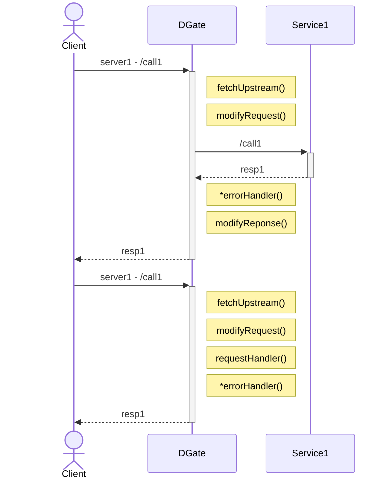
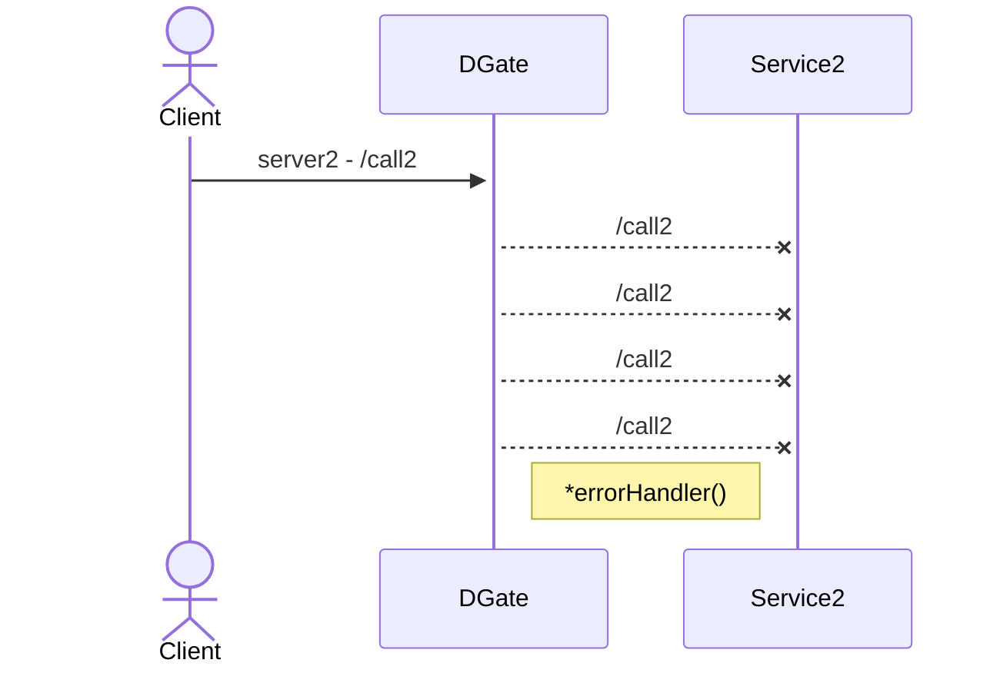

Introducing DGate - A Function Native API Gateway! DGate stands apart as a modular solution. Crafted for speed, efficiency, and seamless usability, redefining how you think of building your infrastructure. What sets DGate alight is its dynamic module support - empowering you to script modules on the fly, no more server restarts or reloads.

Function Native meaning that the actual functions are stored and executed inside of the API Gateway on specific events. This allows for a more efficient and faster way to execute functions. No more need for a separate servers or cloud functions, and which adds more latency and complexity to your architecture.

## API Gateways

An API Gateway is a server that acts as an entry point for clients or an abstraction layer to your services. It is a high-level reverse proxy that sits in front of one or more services. API Gateways usually handle stuff like authentication, retrying, circuit breaker logic, rate limiting, load balancing, and more. Please check out [this article](https://microservices.io/patterns/apigateway.html) for more information.

API Gateways are common in microservice architectures. DGate, for example, can route requests to different services based on the request path, request method, or domain name. This allows you to build services that have intuitive names (i.e. `{service1}.example.com` or `example.com/{service1}`).

## How does DGate differ from other API Gateways?

DGate serves as a versatile API Gateway, equipped with a comprehensive range of functionalities typical for any modern API Gateway including the ability to manage api routes, domains, certs, services, and more.

However, what sets DGate apart is its unique support for dynamic modules for such architectures that need must customization at L7.

Unlike traditional API Gateways, DGate empowers users to develop and integrate modules that can be dynamically loaded at runtime, eliminating the need for server restarts.

This groundbreaking feature enables the creation of custom modules tailored to manipulate and manage requests and responses throughout the request life cycle.

Whether it's authentication, logging, or implementing bespoke business logic, DGate's dynamic module support opens endless possibilities for customization.

Moreover, DGate includes an Admin API for managment resources, powered by embedded [key-value database](https://github.com/dgraph-io/badger). With the Admin API, users gain the ability to create, update, delete, and view resources within their DGate environment. Furthermore, the Admin API offers insights into logs, statistics, and other vital information useful for monitoring and optimizing DGate performance.

DGate also offers replication capabilities for leveraging the [Raft consensus library](https://github.com/hashicorp/raft) created by HashiCorp. This functionality empowers users to deploy multiple DGate instances, ensuring automatic resource replication across all nodes. By harnessing the power of Raft consensus, DGate facilitates the creation of highly available and scalable API Gateway architectures, setting a new standard for reliability and performance in the realm of API management.

### DGate Module Functions

DGate modules are scripts that are run at runtime. Modules can be built in TypeScript or JavaScript. Modules can be used to modify the request or response or handle the request/response in certain functions depending on what variables are exposed.

There are currently 5 module functions:
- [`fetchUpstream`](/docs/resources/modules#fetchUpstream) - this module is used to select an upstream service URL
- [`requestHandler`](/docs/resources/modules#requestHandler) - this module is used to handle the request, instead of using a service.
- [`errorHandler`](/docs/resources/modules#errorHandler) - this module is used to handle errors (network, timeouts, etc.).
- [`responseModifier`](/docs/resources/modules#responseModifier) - this module is used to modify the request before it is sent to the upstream service (or before it is handled by the requestHandler).
- [`requestModifier`](/docs/resources/modules#requestModifier) - this module is used to modify the response before it is sent to the client.

In the case of a non-HTTP error (network, timeout, etc.), the `errorHandler` will be called instead of the modifyResponse. However, if the retries are not exhausted, the `errorHandler` will not be called until the retries are exhausted.
  

### Why use DGate?

DGate not only offers your system a secure, easy of use, flexible, and fault tolerant API Gateway, but also provides a dynamic module system that allows you to customize your API Gateway to your needs.

This allows you to build a system that is tailored to your needs, and not the other way around.

DGate is an attempt at managing software on the edge; including many featuresrollouts and rollbacks