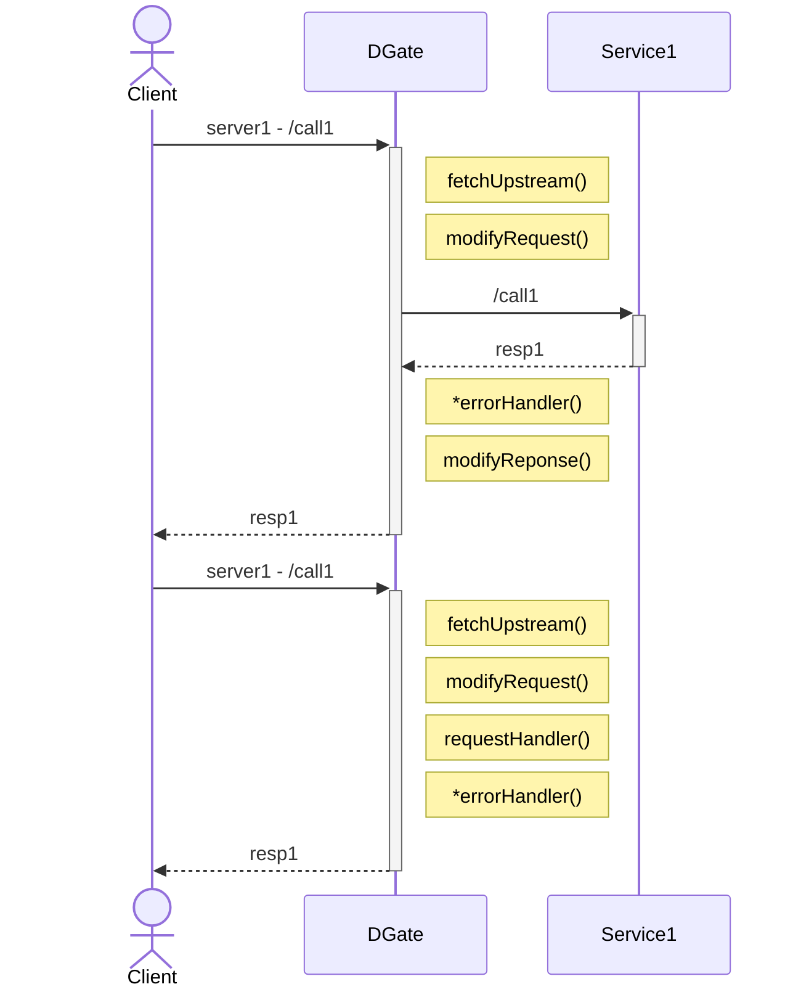
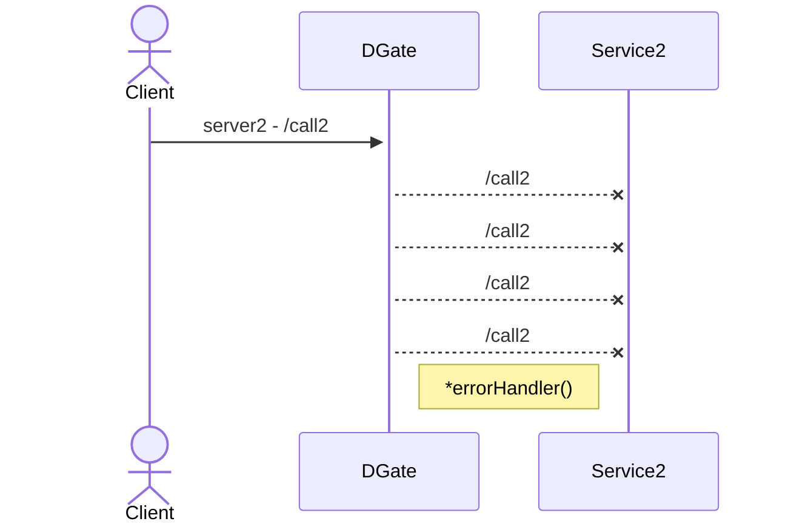

Introducing DGate - your go-to solution for a modern API Gateway! Born from late night coding sessions in Go, DGate stands apart as a module-based solution. Crafted for speed, efficiency, and seamless usability, it redefines the game. What sets DGate alight is its dynamic module support - empowering you to script modules on the fly, no more server restarts or reloads.

## API Gateways

An API Gateway is a server that acts as an entry point for clients or an abstration layer to your services. It is a high-level reverse proxy that sits in front of one or more services. API Gateways usually handle stuff like authentication, retrying, circuit breaker logic, rate limiting, load balancing, and more. Please check out [this article](https://microservices.io/patterns/apigateway.html) for more information.

API Gateways are common in microservice architectures. DGate, for example, can route requests to different services based on the request path, request method, or domain name. This allows you to build services that have intuitive names (i.e. `{service1}.example.com` or `example.com/{service1}`).

## How does DGate differ from other API Gateways?

DGate serves as a versatile API Gateway, equipped with a comprehensive range of functionalities typical for any system. However, what sets DGate apart is its unique support for dynamic modules for such architectures that need must customization at L7. Unlike traditional API Gateways, DGate empowers users to develop and integrate modules that can be dynamically loaded at runtime, eliminating the need for server restarts. This groundbreaking feature enables the creation of custom modules tailored to manipulate and manage requests and responses throughout the request life cycle. Whether it's authentication, logging, or implementing bespoke business logic, DGate's dynamic module support opens endless possibilities for customization.

Moreover, DGate includes a built-in Admin API, complete with its embedded database. This integrated solution enables seamless management of DGate instances via the Admin API interface. With the Admin API, users gain the ability to effortlessly create, update, delete, and view resources within their DGate environment. Furthermore, the Admin API offers insights into logs, statistics, and other vital information vital for monitoring and optimizing DGate performance.

The Admin API has replication capabilities leveraging the Raft consensus algorithm. This functionality empowers users to deploy multiple DGate instances, ensuring automatic resource replication across all nodes. By harnessing the power of Raft consensus, DGate facilitates the creation of highly available and scalable API Gateway architectures, setting a new standard for reliability and performance in the realm of API management.

### DGate Modules

DGate modules are scripts that are run at runtime. Modules can be built in TypeScript or JavaScript. Modules can be used to modify the request or response or handle the request/response in certain functions depending on what variables are exposed.

There are currently 5 module functions:
- `fetchUpstream` - this module is used to select an upstream service URL
- `requestHandler` - this module is used to handle the request, instead of using a service.
- `errorHandler` - this module is used to handle errors (network, timeouts, etc.).
- `responseModifier` - this module is used to modify the request before it is sent to the upstream service (or before it is handled by the requestHandler).
- `requestModifier` - this module is used to modify the response before it is sent to the client.

In the case of a non-HTTP error (network, timeout, etc.), the `errorHandler` will be called instead of the modifyResponse. However, if the retries are not exhausted, the `errorHandler` will not be called until the retries are exhausted.
  

## Resource Types

Namespaces - provide a way to group resources together

Routes - provide a way to match a request to a service or module handler

Services - provide a way to represent an upstream service

Modules - provide a way to customize the request/response data being sent upstream and downstream.

Domains - provide a way to match a request to a namespace

Collections - provide a way to store arbitrary data based on a JSON schema

Documents - provide a way to store arbitrary data in a collection based on a schema

## DGate Client - `dgate-cli`

`dgate-cli` is a command line tool for managing DGate resources. It can be used to create, update, delete, and view resources. It can also be used to view logs, stats, and other information about your DGate instance.

## Conclusion

### DGate vs Kong

DGate aims to bring the simplicity of Kong, but the flexibility of building it yourself utilizing dynamic modules. DGate utilizes similar high-level concepts as Kong but with a different approach for extensibility and ease of use.

### Why not just use Kong?

#### Plugins/Modules

While Kong stands out as one of the top-tier API Gateways available, it's not exempt from shortcomings. One limitation lies in its inability to dynamically load plugins, necessitating manual reloads or even server restarts for integrating new plugins. This process can be cumbersome, particularly for setups requiring high uptime or when swift rollbacks become necessary. To be frank, this isn't really an issue unless you are heavily creating Kong modules.

In response to these challenges, DGate presents an innovative solution utilizing JavaScript/TypeScript and dynamically loaded modules, simplifying the application of plugins to specific routes via a single Admin API call. Embracing resource lifecycle management, DGate facilitates versioning and rollback capabilities for seamless resource modifications. Additionally, its internal state manager and distributed replication system further enhance deployment and maintenance ease from the user's perspective, ensuring DGate stands out as a user-friendly, robust API Gateway solution.

#### Setup

Setting up and maintaining Kong can be cumbersome due to its dependency on a database to store configuration state.

In contrast, DGate streamlines this process by storing data within its integrated database, enabling seamless resource management via the Admin API. Through the Admin API, users can effortlessly create, update, delete, and monitor resources, including logs, statistics, and other pertinent information related to their DGate instance.

Furthermore, DGate offers support for replication using the Raft consensus algorithm. This feature empowers users to deploy multiple DGate instances, ensuring automatic resource replication across all nodes. This not only facilitates the creation of a highly available and scalable API Gateway but also guarantees a consistently reliable Admin API experience.

### Release Plan

DGate Beta has been released and is available on GitHub! You can find the source code and documentation [here](https://github.com/dgate-io/dgate). I plan to release a stable version of DGate hopefully later this year. I will be adding more features, fixing bugs, and improving the documentation. I will also be adding more examples and tutorials to help you get started with DGate.

Thank you for reading this project article! I hope you found it informative and helpful. If you have any questions or feedback, please feel free to reach out to me. I would love to hear from you!